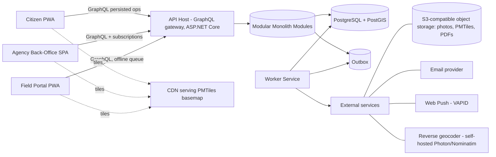
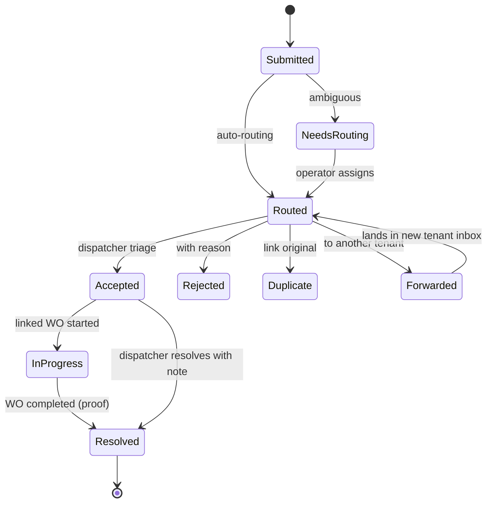
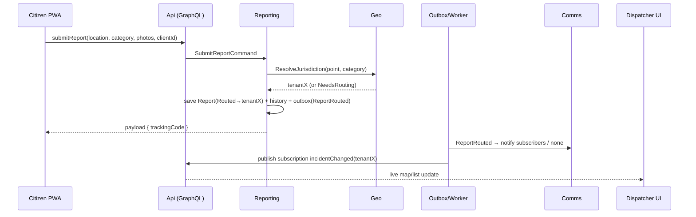

# RoadMaintain — Implementation Plan (MVP → V2)

**Status:** Proposed
**Date:** 2026-06-13
**Deciders:** Founding team (product/domain co-founder + engineering)
**Inputs:** Extended Business Plan (RoadMaintain SaaS), Agency offer document (UI mockups & feature narrative)

---

## 1. Summary & Guiding Constraints

RoadMaintain is a B2G multi-tenant SaaS connecting citizens who report road incidents with the agencies responsible for fixing them. Three user-facing applications sit on one platform:

| App | Audience | Core jobs |
|---|---|---|
| **Citizen App** (PWA) | Drivers, pedestrians | See live incidents/works on a map, report an incident in 2 clicks (photo + GPS), track report status, read announcements |
| **Agency Back-Office** (web) | Owners, dispatchers, managers | Triage incoming reports, prioritize, create & assign work orders, manage resources, publish announcements, dashboards & exports |
| **Field Portal** (PWA) | Field crews | Receive assigned tasks, navigate, update status, upload before/after proof photos, work offline |

The architecture below is shaped by five hard constraints that come straight from the business plan:

1. **Lean budget.** Year-1 hosting budget is ~€600/year (~€50/month) and dev capacity is effectively 1–2 people. Anything that needs a platform team is out.
2. **Avoid commercial map API fees.** The plan explicitly commits to vector maps without Google-Maps-class per-request pricing.
3. **B2G sales reality.** Tenants are won one at a time, onboarding follows a fixed 4-week playbook (configuration → training → launch), churn is near zero, and a future tender may demand dedicated/on-prem data hosting.
4. **Trust & auditability are the product.** Lost reports and "no proof of work" are the problems being sold against — so status history, proof photos, and audit trails are first-class, not afterthoughts.
5. **Must scale organizationally, not (yet) in throughput.** Even at 45 tenants (Year 5), raw load is small (Serbian municipalities of 30–80k residents generate tens of reports/day, with storm bursts). The real scaling axes are: number of tenants, number of modules, number of integrations, and the option to split into services later.

**Headline decision:** a **modular monolith** on **.NET (current LTS) + Aspire**, with **PostgreSQL + PostGIS** as the single source of truth, **HotChocolate GraphQL** as the API for all three apps, **DDD bounded contexts as in-process modules**, and **event-driven communication via in-process domain events + a transactional outbox** — designed so that modules can be extracted into services and the outbox can be re-pointed at a message broker without rewriting domain code.

Your preferred stack (GraphQL, DDD, event-driven, PostgreSQL, C#/.NET Aspire, EF Core) is not just acceptable — it is close to the best-fit stack for this problem. The plan below keeps all of it and only adds discipline around *how* it's used so the MVP ships in months, not quarters.

---

## 2. Requirements

### 2.1 Functional requirements (MVP), by actor

**Citizen / Driver**
- FR-C1: View a public map of active incidents, ongoing works, and closures (no login required).
- FR-C2: Report an incident: pick/auto-detect location, choose category (pothole, signage, landslide, guardrail, obstacle, other), add photo(s) and short description. Two-click happy path; anonymous reporting allowed, optional contact (e-mail / push subscription) for status updates.
- FR-C3: Track own reports and their statuses (received → in progress → resolved), with the resolution photo when available.
- FR-C4: Read announcements (planned works, closures, detours) published by agencies relevant to the viewed area.

**Agency — Dispatcher / Manager / Owner**
- FR-A1: Unified inbox of reports routed to the agency, with list + map view, filters (status, category, priority, date, municipality/zone).
- FR-A2: Triage a report: accept / reject (with reason) / mark duplicate (link to original) / forward to another agency (mis-routed).
- FR-A3: Set priority (urgent / important / can wait) and internal notes.
- FR-A4: Create a work order from one or more reports: description, category, location/segment, assignee (crew/worker), due date, attachments.
- FR-A5: Track work order lifecycle, see status changes, field notes, and before/after photos; close with mandatory proof-of-work photo.
- FR-A6: Manage resources: crews, workers, vehicles (name, type, capabilities); see field workers' live positions on the map while on duty (app-based, consent-based — *no GPS hardware in MVP*).
- FR-A7: Publish announcements (title, body, affected area/segment, time window) → visible in citizen app.
- FR-A8: Dashboard: open reports by status/category, average resolution time, completed this week, per-zone counts.
- FR-A9: Exports: work order PDF (printable, for the binder/inspection), CSV/Excel of reports & work orders for a period — the "ministry asked for data" use case.
- FR-A10: Segment/zone history: per road segment or zone, list of past reports and works.
- FR-A11: Tenant administration: users & roles, jurisdiction boundaries (draw/upload GeoJSON), categories config, module visibility per package.

**Field worker**
- FR-F1: See my assigned tasks (list + map), with details, photos, and navigation hand-off (open in OS maps app).
- FR-F2: Update status: en route → on site → in progress → paused (reason) → done; add notes and photos at each step.
- FR-F3: Mandatory proof photo on completion (camera capture).
- FR-F4: Work with poor/no connectivity: queue status updates and photos locally, sync when online.
- FR-F5: Share location while on duty (toggle, visible to dispatcher).

**Platform (you, as the operator)**
- FR-P1: Provision a tenant (agency) with package (Small/Medium/Large), modules, jurisdiction, branding-lite (name, logo).
- FR-P2: Route every citizen report to the correct tenant automatically by location + road class rules; ambiguous reports land in a platform triage queue.
- FR-P3: Per-tenant feature flags & entitlements; ops kill-switches.
- FR-P4: Audit log of sensitive actions (triage decisions, deletions, role changes).

### 2.2 Non-functional requirements

| NFR | Target (MVP) | Notes |
|---|---|---|
| Availability | 99.5% single-region | One VPS + managed backups is acceptable for pilots; document the SLA honestly in contracts |
| Latency | p95 < 300 ms API reads; map tiles via CDN | Tiles are static files (PMTiles) → CDN does the work |
| Scale envelope | 50 tenants, 100k reports/yr, 200 concurrent dispatchers, 2k concurrent citizens during a storm burst | Orders of magnitude below Postgres/.NET limits — verify with a k6 smoke test, don't pre-optimize |
| Data isolation | Hard tenant isolation for agency data (RLS + query filters); citizen reports are platform-owned, visible to assigned tenant | See ADR-002 |
| Offline | Field portal queues mutations & photos offline; citizen report drafts survive refresh | |
| Security | OWASP ASVS L1+, signed URLs for media, persisted GraphQL operations on the public surface, audit trail | |
| Privacy | Serbian ZZPL (GDPR-aligned): anonymous reporting, EXIF GPS stripped from publicly displayed photos, retention policy, DPA-ready processing records | |
| Localization | sr (Latin) first, full i18n scaffolding from day 1 (en next; regional languages per Phase 2 of the business plan) | |
| Auditability | Append-only status history on reports & work orders; domain events persisted | |
| Cost | ≤ €50/month infra in Year 1 | Hetzner VPS + object storage + free tiers |

### 2.3 Constraints
- Team: 1–2 engineers; the domain co-founder validates workflows but doesn't code.
- Timeline: MVP pilot-ready in ~4–5 months (matches Phase 1 of the business plan).
- Stack preference honored: C#/.NET + Aspire, EF Core, PostgreSQL, GraphQL, DDD, event-driven.
- Procurement reality: must be able to answer "where is our data?" and "can we have it dedicated?" without redesign (→ tenancy abstraction supports a dedicated-DB flavor even if unused in MVP).

---

## 3. Architecture Overview

### 3.1 System context



Two deployable processes in MVP — **Api** (GraphQL host loading all modules) and **Worker** (outbox dispatcher, background jobs, notifications, image processing) — plus PostgreSQL, object storage, and a CDN for tiles. Aspire orchestrates all of it in dev and produces the deployment artifacts.

### 3.2 Bounded contexts → modules

DDD contexts map 1:1 to in-process modules. Each module owns its **own EF Core `DbContext` and its own Postgres schema**, exposes a small **Contracts** package (commands it accepts, integration events it publishes, query interfaces), and never references another module's internals.

| Bounded context | Schema | Owns | Publishes (integration events) |
|---|---|---|---|
| **Tenancy & Entitlements** | `tenancy` | Agencies, packages, modules, feature flags, jurisdiction config refs | `TenantProvisioned`, `EntitlementsChanged` |
| **Identity & Access** | `identity` | Users, credentials, tenant memberships, roles | `UserInvited`, `MembershipChanged` |
| **Geo & Routing** | `geo` | Jurisdiction polygons, road segments, routing rules, geocoding cache | `JurisdictionUpdated` |
| **Incident Reporting** | `reporting` | Citizen reports, triage, statuses, duplicates, public map read model | `ReportSubmitted`, `ReportRouted`, `ReportTriaged`, `ReportResolved` |
| **Work Management** | `work` | Work orders, tasks, assignments, field status updates, proof-of-work | `WorkOrderCreated`, `WorkOrderAssigned`, `TaskStatusChanged`, `WorkOrderCompleted` |
| **Resources** | `resources` | Crews, workers, vehicles, duty sessions, last-known positions | `DutySessionStarted/Ended` |
| **Communications** | `comms` | Announcements, notification preferences, outbound notifications log | `AnnouncementPublished` |
| **Analytics & Exports** | `analytics` | Denormalized read models for dashboards, segment history, export jobs | — (consumer only) |
| **Media** (building block) | `media` | Photo metadata, processing status, signed URL issuance | `MediaProcessed` |

Module-to-module communication rules:
- **Synchronous:** only via Contracts interfaces (e.g., `Work` asks `Geo` "which segment is nearest to this point?") — never via another module's DbContext.
- **Asynchronous:** integration events through the outbox. `Analytics`, `Comms`, and `Media` are pure consumers, which is exactly why they're the first extraction candidates in V2.

### 3.3 The three apps — tech choice

All three frontends: **React + TypeScript + Vite + MapLibre GL JS**, in a monorepo with a shared UI package (design system, map components, GraphQL client config). Citizen and Field apps are installable PWAs (service worker, manifest, offline support); Back-Office is a desktop-first SPA.

Why not Blazor, given a C# team? Honest trade-off: Blazor WASM is viable, but this product is *map-centric*, and MapLibre/deck.gl ecosystems, offline service-worker patterns, and mobile PWA polish are all materially better and better-documented in the React/TS world. The JS interop tax on a map-heavy Blazor app is paid on every feature, forever. One backend dev who is "okay" at TypeScript ships these UIs faster than a Blazor expert fighting interop. (If the team is strictly C#-only and unwilling, Blazor is the fallback — the backend design is unaffected.)

GraphQL serves all three apps from **one schema** with strict authorization; the citizen surface is additionally locked down to **persisted operations only** (see §7).

---

## 4. Key Architecture Decisions (ADRs)

Condensed index — full records follow.

| # | Decision | Choice |
|---|---|---|
| ADR-001 | Deployment architecture | Modular monolith on .NET Aspire (2 processes), service-extraction-ready |
| ADR-002 | Multi-tenancy model | Shared DB + shared schema, `tenant_id` + EF global filters + Postgres RLS; "hub" model for citizens; dedicated-DB flavor reserved for V2 |
| ADR-003 | Report → agency routing | PostGIS jurisdiction polygons + road-class rules + nearest-segment fallback + manual triage queue |
| ADR-004 | API style | GraphQL (HotChocolate) single graph; persisted operations for the public surface; REST only for uploads/webhooks/health |
| ADR-005 | Eventing | In-process domain events + transactional outbox; broker (RabbitMQ) deferred to V2 behind the same contracts |
| ADR-006 | Feature flags & entitlements | DB-backed, package-driven entitlements + ops flags, served through `Microsoft.FeatureManagement` abstractions with per-tenant context |
| ADR-007 | Maps & geocoding | MapLibre GL + self-hosted Protomaps (PMTiles) basemap on object storage/CDN; self-hosted Photon/Nominatim reverse geocoding |
| ADR-008 | Identity | ASP.NET Core Identity + JWT (access/refresh) in-process for MVP; OIDC/SSO via OpenIddict or Keycloak in V2 |

---

### ADR-001: Modular Monolith on .NET Aspire (vs. Microservices vs. Classic Layered Monolith)

**Status:** Proposed · **Date:** 2026-06-13 · **Deciders:** Founding team

#### Context
Three apps, ~9 bounded contexts, 1–2 developers, €50/month infra, and an explicit ambition to "grow very big and possibly be distributed in the future." The classic failure modes here are (a) microservices day one → drowning in ops with no users, or (b) a big-ball-of-mud monolith → can never be split.

#### Options Considered

**Option A: Microservices from day one (one service per context, broker, K8s)**

| Dimension | Assessment |
|---|---|
| Complexity | High — service discovery, distributed tracing, per-service CI/CD, broker ops |
| Cost | High — multiple nodes, broker, registry; blows the €50/mo budget |
| Scalability | Excellent technically; irrelevant at MVP load |
| Team familiarity | Punishing for 1–2 devs |

**Pros:** independent deploys; clean future story. **Cons:** months of plumbing before first feature; distributed transactions for workflows (report→work order) that are naturally local; debugging across services with no platform team.

**Option B: Classic layered monolith (one project, one DbContext)**

| Dimension | Assessment |
|---|---|
| Complexity | Low initially, high later — boundaries erode |
| Cost | Minimal |
| Scalability | Vertical only; extraction later = surgery |
| Team familiarity | High |

**Pros:** fastest first demo. **Cons:** by tenant #10 the coupling between reporting, work, and analytics makes every change risky; "distributable in the future" becomes a rewrite.

**Option C (chosen): Modular monolith — module-per-context, schema-per-module, contracts + events between modules, hosted as Api + Worker via Aspire**

| Dimension | Assessment |
|---|---|
| Complexity | Medium — discipline required, infra trivial |
| Cost | Minimal (1 VPS) |
| Scalability | Vertical now; per-module extraction later is mechanical |
| Team familiarity | High (it's still one solution, one debugger, one deploy) |

#### Trade-off Analysis
The only thing Option C costs over B is discipline (enforced cheaply with architecture tests — see §13). The only thing it lacks vs. A is independent runtime scaling, which nothing in the 5-year load profile requires. Aspire gives the missing microservice-y comforts (orchestration, OTel tracing, health checks, resilience defaults) without distributed runtime.

#### Consequences
- Easier: shipping vertical slices fast; one transaction per use case; local debugging; cheap hosting.
- Harder: must police module boundaries (no cross-module DbContext refs); shared DB means coordinated migrations.
- Revisit: when a module needs independent scaling/team ownership, or a tender demands isolated deployment — extraction path is pre-paved (§14).

#### Action Items
1. [ ] Solution skeleton with module template (Domain/Application/Infrastructure/Contracts) — see Appendix A.
2. [ ] NetArchTest rules: modules may reference only `Contracts` of other modules + `BuildingBlocks`.
3. [ ] Aspire AppHost wiring Api, Worker, Postgres, MinIO, Mailpit for local dev.

---

### ADR-002: Multi-Tenancy — Shared Schema + RLS, with a Citizen "Hub"

**Status:** Proposed · **Date:** 2026-06-13 · **Deciders:** Founding team

#### Context
Tenants are agencies. But citizens are **not** tenant users — a driver in Ćuprija doesn't know or care which utility maintains which road. Reports must enter a **platform-level pool** and be *delegated* to tenants by geography (ADR-003). Meanwhile agency data (work orders, resources, internal notes) must be hard-isolated per tenant: B2G buyers ask about this directly, and a leak between two municipal utilities would be commercially fatal. Year-5 target is only ~45 tenants, but a single Large tender may demand dedicated data hosting.

#### Options Considered

**Option A: Database-per-tenant**

| Dimension | Assessment |
|---|---|
| Complexity | High — migrations ×N, connection routing, cross-tenant queries (platform analytics, report routing) become painful |
| Cost | Medium–High (many DBs or schemas to babysit) |
| Isolation | Strongest |
| Fit for citizen hub | Poor — citizen reports span tenants; needs a separate shared DB anyway |

**Option B: Shared DB, schema-per-tenant**

Middle ground; still migrations ×N and dynamic schema routing in EF; weak payoff at this scale.

**Option C (chosen): Shared DB, shared schema; `tenant_id` discriminator; EF Core global query filters + PostgreSQL Row-Level Security as defense-in-depth; platform-owned tables (citizen reports, geo) carry `assigned_tenant_id` instead**

| Dimension | Assessment |
|---|---|
| Complexity | Low–Medium (one migration set; two well-known mechanisms) |
| Cost | Minimal |
| Isolation | Strong in practice: app-layer filter bugs are caught by DB-layer RLS |
| Fit for citizen hub | Natural — reports live platform-side, visibility granted to the assigned tenant |

#### Decision details
- **Tenant resolution:** agency & field users carry `tenant_id` in their JWT (membership-derived); every request opens a transaction and sets `SELECT set_config('app.tenant_id', $1, true)` (transaction-local — safe with connection pooling) via an EF `DbConnectionInterceptor`. Citizen requests run as tenant-less; they touch only platform-owned tables and public read models.
- **RLS:** enabled on every tenant-owned table; app role has no `BYPASSRLS`; migrations run under a separate role.

```sql
ALTER TABLE work.work_order ENABLE ROW LEVEL SECURITY;
ALTER TABLE work.work_order FORCE ROW LEVEL SECURITY;
CREATE POLICY tenant_isolation ON work.work_order
  USING (tenant_id = current_setting('app.tenant_id', true)::uuid);
```

- **EF Core:** `modelBuilder.Entity<T>().HasQueryFilter(e => e.TenantId == _tenant.Id)` applied by convention to every `ITenantOwned` entity; write-side guard sets/validates `TenantId` in `SaveChanges` interceptor.
- **Dedicated-DB option (V2, sales-driven):** all data access already flows through an `ITenantConnectionResolver`. MVP returns the single connection string; V2 can map a Large tenant to its own database (same schema, same migrations) without touching domain code. This is the honest answer to "can we have our own database?" in a tender.

#### Consequences
- Easier: routing reports across tenants, platform analytics, one migration pipeline, trivial backups.
- Harder: every new table needs the RLS policy + filter (solved with a migration helper + architecture test); noisy-neighbor risk is theoretical at this load.
- Revisit: if a tenant contractually requires physical isolation → activate dedicated-DB flavor; if tenant count > a few hundred → consider partitioning hot tables by `tenant_id`.

#### Action Items
1. [ ] `ITenantContext`, JWT claim mapping, connection interceptor with `set_config`.
2. [ ] Migration helper `ApplyTenantRls(table)`; CI test asserting every `ITenantOwned` table has a policy.
3. [ ] `ITenantConnectionResolver` seam (single-DB impl).
4. [ ] Pen-test style integration test: tenant A token can never read tenant B rows even with the EF filter disabled.

---

### ADR-003: Geographic Report Routing (the actually hard problem)

**Status:** Proposed · **Date:** 2026-06-13 · **Deciders:** Founding team + domain co-founder

#### Context
A report is a point (plus photo and category). Responsibility in the Balkans is split by *territory* **and** *road class*: a state road (IA/IB/II) through a town is maintained by the state-road contractor; the side streets by the city utility; two municipalities may both border the incident. Mis-routing erodes exactly the trust the product sells. The domain co-founder can enumerate the real-world rules — encode them, don't guess.

#### Decision
A deterministic routing pipeline in the `Geo` module, executed when a report is submitted, producing either an assignment or a platform triage item:

1. **Candidate jurisdictions:** `ST_Contains(jurisdiction.boundary, point)` over tenant jurisdiction polygons (GiST-indexed). Jurisdictions are uploaded/drawn during onboarding (GeoJSON import + map editor) — this is Week 1–2 of the existing onboarding playbook.
2. **Road-class rules:** each jurisdiction row carries an optional `road_class_filter` (e.g., `{local, street}` vs `{IA, IB, II}`). The report's road class comes from the **nearest road segment** within a tolerance:

```sql
SELECT r.id, r.road_class, r.managing_tenant_id
FROM geo.road_segment r
WHERE ST_DWithin(r.geom::geography, ST_SetSRID(ST_MakePoint(@lon,@lat),4326)::geography, 30)
ORDER BY r.geom <-> ST_SetSRID(ST_MakePoint(@lon,@lat),4326)
LIMIT 1;
```

   Road segments are imported from OpenStreetMap per region during onboarding (filtered `highway=*` extract), with the option to override `managing_tenant_id` per segment for known special cases.
3. **Priority resolution:** if multiple candidates remain, pick by explicit `jurisdiction.priority`; if still ambiguous or zero candidates → **platform triage queue** (you manually assign in the operator console; the choice is recorded).
4. **Human override is a feature:** dispatchers can "Forward to another agency" (FR-A2). Every manual correction is stored as a `routing_correction` row — this is both an audit trail and, later, training data for smarter routing.

#### Options considered & rejected
- *Pure point-in-polygon* — fails on the state-road-through-town case the co-founder will raise in the first demo.
- *Ask the citizen to pick the agency* — citizens don't know; destroys the 2-click promise.
- *ML routing day one* — no data yet; the corrections log builds the dataset first.

#### Consequences
- Easier: provable, explainable routing ("it went to you because the point is in your polygon and the nearest segment is class II"); onboarding maps cleanly to the playbook.
- Harder: OSM data quality varies — mitigation: tolerance + triage queue + per-segment overrides; geometry editing UI is real work (use MapLibre + Terra Draw).
- Revisit: when corrections cluster (e.g., a boundary is wrong), feed back into polygon edits; V2 may add suggestion ranking from the corrections dataset.

#### Action Items
1. [ ] `geo` schema: `jurisdiction(tenant_id, boundary geometry(MultiPolygon,4326), road_class_filter text[], priority int)`, `road_segment(geom geometry(LineString,4326), road_class, managing_tenant_id null)`, GiST indexes.
2. [ ] OSM import script (osmium/pyosmium or Osmosis → COPY) parameterized by region bbox.
3. [ ] Routing service + unit tests with the co-founder's enumerated edge cases as fixtures.
4. [ ] Operator triage queue UI + `routing_correction` log.

---

### ADR-004: GraphQL (HotChocolate) as the API for all three apps

**Status:** Proposed · **Date:** 2026-06-13

#### Context
Three clients with very different shapes over the same domain (citizen: tiny public slice; back-office: rich filtered lists, map bbox queries, live updates; field: small offline-friendly payloads). Preference for GraphQL stated.

#### Decision
One **HotChocolate** server in the Api host; each module contributes type extensions (`[QueryType]/[MutationType]` partials per module assembly). Conventions:
- **Reads:** projections + filtering + paging wired to module DbContexts (HotChocolate's EF integration); map queries take a `bbox` argument and return lightweight GeoJSON-ish DTOs.
- **Writes:** every mutation maps 1:1 to an application-layer **command** (thin resolvers; domain logic lives in modules). Mutations follow the *payload* convention (`{ result, errors[] }` with typed user errors).
- **Subscriptions:** `incidentChanged(tenantId)`, `workOrderChanged(tenantId)`, `fieldPositionChanged(tenantId)` over WebSockets; **in-memory** subscription provider in MVP (single node), Redis provider when scaling out — config change, not redesign.
- **Public surface hardening:** the citizen app ships with **persisted operations only** (allow-list), depth/complexity limits, and rate limiting; introspection off in production for anonymous callers.
- **REST exceptions (deliberate):** `POST /media/upload-url` (presigned upload handshake), `/healthz`, future inbound webhooks. File bytes never travel through GraphQL.

**Options considered:** REST/OpenAPI (fine, but 3 divergent clients → endpoint sprawl or over-fetching; subscriptions need SignalR anyway); separate schemas per app (cleaner blast radius but triples maintenance — revisit only if the public surface needs independent release cadence).

#### Consequences
- Easier: each frontend pulls exactly its shape; live dispatcher map is native via subscriptions; one schema = one contract to document for V2 partner API.
- Harder: authorization must be airtight per-field (covered by `@authorize` policies + tenant filtering at the DbContext level — RLS backstops mistakes); N+1 risks (DataLoaders by default).
- Revisit: if external partners get API access in V2, publish a stable subset (persisted ops or a dedicated schema).

---

### ADR-005: Eventing — Domain Events + Transactional Outbox now, Broker later

**Status:** Proposed · **Date:** 2026-06-13

#### Context
Event-driven is both a preference and a genuine fit (statuses, notifications, projections, audit). But a broker (RabbitMQ/Kafka) on day one adds an ops dependency the budget and team don't need, and 95% of MVP workflows are single-transaction local.

#### Decision
Three event tiers with strict semantics:

1. **Domain events** (in-process, same transaction): raised by aggregates, collected by a `SaveChanges` interceptor, dispatched via MediatR `INotification` handlers *within the same unit of work*. Used for intra-module side effects and for writing the audit/status-history rows atomically.
2. **Integration events** (cross-module, async): serialized into `infra.outbox_message` in the **same transaction** as the state change. A Worker-hosted dispatcher polls with `FOR UPDATE SKIP LOCKED`, invokes registered in-process consumers (Comms, Analytics, Media), marks processed, retries with backoff, parks poison messages. Consumers are idempotent via an `infra.inbox_consumed(message_id, consumer)` table.
3. **Client events:** consumers publish to GraphQL subscription topics after handling.

```sql
CREATE TABLE infra.outbox_message (
  id uuid PRIMARY KEY,
  occurred_at timestamptz NOT NULL,
  type text NOT NULL,
  payload jsonb NOT NULL,
  tenant_id uuid NULL,
  attempts int NOT NULL DEFAULT 0,
  next_attempt_at timestamptz NOT NULL DEFAULT now(),
  processed_at timestamptz NULL,
  error text NULL
);
CREATE INDEX ix_outbox_pending ON infra.outbox_message (next_attempt_at)
  WHERE processed_at IS NULL;
```

**The V2 broker swap is contained by design:** consumers depend on `IIntegrationEventHandler<T>` and contracts only. Moving to RabbitMQ = the dispatcher publishes to the broker instead of invoking handlers in-process, and extracted services host the same handler classes. No domain code changes. (Library note: hand-rolled outbox is ~300 lines and fully understood; Wolverine or CAP are credible batteries-included alternatives if you'd rather not own it — avoid betting on MassTransit v9 given its move to commercial licensing; v8 remains OSS if chosen.)

**Rejected:** event sourcing — auditability is achieved with status-history tables + persisted events at a fraction of the complexity; full broker day one — ops cost without load to justify it.

#### Consequences
- Easier: exactly-once-ish local workflows; audit for free; notifications/analytics decoupled from request latency.
- Harder: one more table & background loop to monitor (expose outbox lag as a metric from day 1).
- Revisit: introduce the broker when the first module is extracted or when an integration consumer (e.g., webhook fan-out) needs independent scaling.

---

### ADR-006: Feature Flags & Entitlements

**Status:** Proposed · **Date:** 2026-06-13

#### Context
Flags serve three distinct purposes here and conflating them causes mess: (a) **entitlements** — which modules a tenant bought (maps to Small/Medium/Large packages); (b) **ops flags** — kill switches & gradual rollout of risky features; (c) **experiments** — later. Multi-tenant means every evaluation is tenant-scoped.

#### Decision
- **Model:** `tenancy.package(feature defaults)` → `tenancy.tenant_feature(tenant_id, feature_key, state, config jsonb)` as override. Changing a tenant's package rewrites effective entitlements; `EntitlementsChanged` event busts caches.
- **Evaluation:** a custom `IFeatureDefinitionProvider` + tenant-aware context feeding `Microsoft.FeatureManagement` (`IFeatureManager` stays the app-facing abstraction), backed by HybridCache (in-proc + invalidation). Swappable later for OpenFeature/flagd or a SaaS without touching call sites.
- **Enforcement points:** GraphQL — a `[RequireFeature("announcements")]` directive/middleware returning a typed `FEATURE_DISABLED` error; UI — an `entitlements` query drives navigation visibility; background — consumers check before doing per-tenant work.
- **Catalog (initial):** `reporting.core` (always on), `work.orders`, `field.portal`, `comms.announcements`, `resources.map`, `analytics.dashboard`, `exports.pdf`, `exports.excel`, `reporting.public-map`, `geo.segment-history` — and ops flags like `ops.routing-v2`, `ops.push-notifications`.
- Package → module matrix mirrors the pricing tiers in the business plan (Small: core reporting + work + field + announcements; Medium: + resources map, PDF/Excel exports, multi-zone; Large: + analytics dashboard, segment history, API access when it exists).

#### Consequences
- Easier: sales packaging is config, not code; safe incremental rollout per pilot tenant.
- Harder: every module feature needs a flag decision at design time (cheap, but a habit).
- Revisit: adopt OpenFeature provider model if/when experimentation or % rollouts are needed.

---

### ADR-007: Maps, Tiles & Geocoding without per-request fees

**Status:** Proposed · **Date:** 2026-06-13

#### Context
The business plan commits to avoiding commercial map API pricing. Needs: basemap in 3 apps, drawing tools (jurisdictions), markers/clusters, reverse geocoding ("Ulica Kneza Miloša 14" looks credible in a work order PDF), and navigation hand-off for crews.

#### Decision
- **Rendering:** MapLibre GL JS (BSD) everywhere; shared map component in the UI package.
- **Basemap tiles:** **Protomaps** — a single PMTiles file (Serbia/region extract, a few GB) hosted on object storage behind the CDN; zero per-request licensing, predictable cost. Fallback/dev: OpenFreeMap public tiles. OSM attribution displayed as required.
- **Reverse geocoding:** self-hosted **Photon** (or Nominatim) container with a Serbia extract for street-level reverse geocodes; results cached in `geo.geocode_cache`. Free-tier LocationIQ as emergency fallback toggle (ops flag).
- **Drawing:** Terra Draw plugin for jurisdiction/segment editing.
- **Navigation:** deep-link to the device's maps app (`geo:` / Google/Apple Maps URL) — don't build routing.
- **Updates:** quarterly tile/geocoder data refresh job (documented runbook step).

**Rejected:** Google Maps Platform (cost model the plan explicitly avoids; ToS friction with storing/deriving data), Mapbox (better DX, but usage pricing reintroduces the same risk).

#### Consequences
- Easier: cost is flat (~storage + CDN egress); offline-friendly tiles for the field app (cache recent tiles in the service worker).
- Harder: you own the tile/geocoder refresh pipeline (a script + runbook, not a service); Serbian address coverage in OSM is good in cities, thinner rurally — reverse geocode is decorative metadata, never a routing input, so degradation is acceptable.

---

### ADR-008: Identity & Access

**Status:** Proposed · **Date:** 2026-06-13

#### Decision (condensed)
- **MVP:** ASP.NET Core Identity (users in `identity` schema) + short-lived JWT access tokens + rotating refresh tokens, issued by the Api host itself. Memberships: `user ↔ tenant ↔ role` (Owner, Manager, Dispatcher, FieldWorker); platform roles (Operator). Citizens: anonymous by default; optional passwordless e-mail link or push-subscription-only tracking (a report tracking code works with zero PII).
- **Why not Keycloak/Auth0 now:** another stateful container (or bill) and ops surface for exactly four roles and no SSO requirement in pilots. The seam is standard: when a Large tenant asks for Entra ID/AD FS SSO (they will), add OpenIddict or Keycloak as the OIDC layer in front — the app already consumes claims-based principals, so this is additive.
- 2FA (TOTP) for Owner/Manager roles from day one; audit log on auth events.

---

## 5. Domain Design (DDD Deep Dive)

### 5.1 Core aggregates & invariants

| Aggregate (context) | Key invariants |
|---|---|
| `Report` (Reporting) | Location + category required; photos ≤ N; status transitions only via defined machine; duplicate must link an original in the same tenant pool; rejection requires a reason; resolution only via linked work-order completion or explicit dispatcher action with note |
| `WorkOrder` (Work) | Belongs to exactly one tenant; may link 1..n reports; cannot reach `Completed` without ≥1 proof photo taken in-app; assignment requires an active crew/worker; due date ≥ today at creation |
| `Crew` / `Worker` / `Vehicle` (Resources) | Worker belongs to ≤1 crew at a time; duty session has at most one open interval per worker |
| `Jurisdiction` (Geo) | Valid (non-self-intersecting) MultiPolygon; belongs to one tenant; priority unique within overlapping sets (validated on save) |
| `Announcement` (Comms) | Publish window valid; affected area optional geometry; only Manager+ can publish |
| `Tenant` (Tenancy) | Package determines entitlement defaults; deactivation suspends logins but never deletes data (procurement/audit reality) |

### 5.2 Report lifecycle



Every transition appends to `reporting.report_status_history (report_id, from, to, actor, note, occurred_at)` — this table *is* the citizen-visible timeline and the audit trail. The same pattern applies to work orders (`work.work_order_history`).

### 5.3 Work order lifecycle

`Draft → Scheduled → Assigned → InProgress ⇄ OnHold(reason) → Completed(proof required) → Closed(by dispatcher)`; `Cancelled` reachable from any pre-Completed state with a reason. Field statuses (`EnRoute`, `OnSite`) are task-level events inside `Assigned/InProgress`, not separate aggregate states — keeps the machine small while the field timeline stays rich.

### 5.4 Cross-context choreography (the money path)



The dispatcher's "create work order from report" and the field crew's "complete with proof" follow the same shape: command → aggregate → history row + outbox → projections/notifications/subscriptions.

---

## 6. Data Architecture

### 6.1 Principles
- One PostgreSQL 17 cluster, **PostGIS** extension, schema-per-module (see §3.2), `NetTopologySuite` mapped via the Npgsql EF provider.
- UUIDv7 primary keys (time-ordered, index-friendly); `timestamptz` everywhere; soft state via status columns + history tables, **no soft-delete flags** on transactional data (B2G: you never delete, you cancel/close).
- All tenant-owned tables: `tenant_id uuid NOT NULL` + RLS policy + composite indexes leading with `tenant_id`.
- Media files in S3-compatible object storage; DB stores metadata + keys only.

### 6.2 Key tables (sketch)

```sql
-- reporting (platform-owned; visibility via assigned_tenant_id)
CREATE TABLE reporting.report (
  id uuid PRIMARY KEY,
  tracking_code text UNIQUE NOT NULL,          -- citizen-facing, no PII needed
  category text NOT NULL,
  description text NULL,
  location geometry(Point, 4326) NOT NULL,
  address_hint text NULL,                       -- reverse-geocode result, decorative
  road_segment_id uuid NULL,
  status text NOT NULL,
  assigned_tenant_id uuid NULL,
  reporter_contact jsonb NULL,                  -- optional email/push sub, encrypted at app layer
  client_command_id uuid UNIQUE NOT NULL,       -- idempotency for retries/offline
  created_at timestamptz NOT NULL
);
CREATE INDEX ix_report_geo ON reporting.report USING gist (location);
CREATE INDEX ix_report_tenant_status ON reporting.report (assigned_tenant_id, status, created_at DESC);

-- work (tenant-owned, RLS)
CREATE TABLE work.work_order (
  id uuid PRIMARY KEY,
  tenant_id uuid NOT NULL,
  number text NOT NULL,                         -- human-friendly per-tenant sequence: WO-2026-00042
  title text NOT NULL,
  priority text NOT NULL,                       -- urgent | important | can_wait
  status text NOT NULL,
  location geometry(Point,4326) NULL,
  assigned_crew_id uuid NULL,
  due_date date NULL,
  created_by uuid NOT NULL,
  created_at timestamptz NOT NULL,
  UNIQUE (tenant_id, number)
);

CREATE TABLE work.work_order_report (            -- link table to citizen reports
  work_order_id uuid NOT NULL,
  report_id uuid NOT NULL,
  PRIMARY KEY (work_order_id, report_id)
);

-- media (referenced from reports, work orders, announcements)
CREATE TABLE media.photo (
  id uuid PRIMARY KEY,
  tenant_id uuid NULL,                          -- null when citizen-submitted
  owner_type text NOT NULL, owner_id uuid NOT NULL,
  kind text NOT NULL,                           -- report | before | after | note
  storage_key text NOT NULL,
  status text NOT NULL,                         -- pending | processed | rejected
  exif_stripped boolean NOT NULL DEFAULT false,
  captured_at timestamptz NULL,
  created_at timestamptz NOT NULL
);
```

Plus, as introduced earlier: `geo.jurisdiction`, `geo.road_segment`, `geo.routing_correction`, `infra.outbox_message`, `infra.inbox_consumed`, history tables per aggregate, `tenancy.*` (tenant, package, tenant_feature, membership), `comms.announcement`, `resources.*` (crew, worker, vehicle, duty_session, last_position), `analytics.*` read models.

### 6.3 Read models & projections
Dashboards (FR-A8) and segment history (FR-A10) are **projected tables in `analytics`**, maintained by outbox consumers (`daily_counts(tenant_id, date, category, status, n)`, `segment_history(...)`). At MVP scale you could query live tables, but projecting from day 1 (a) keeps dashboard queries trivial and index-light, (b) exercises the event pipeline continuously so it's trustworthy before V2 leans on it harder.

### 6.4 Media pipeline (photos are the product's evidence)
1. Client asks `POST /media/upload-url` → presigned PUT to object storage (size/type constrained), gets `photoId`.
2. Client uploads bytes directly to storage (never through the API), then references `photoId` in the mutation.
3. Worker processes on `MediaUploaded`: validate magic bytes, re-encode (strip EXIF — keep GPS/timestamp server-side in metadata for verification, never in the public file), generate thumbnail + display sizes, mark `processed`.
4. Reads go through short-lived signed GET URLs; public map uses processed, anonymized derivatives only.
5. Field-app proof photos must be camera-captured in-app (capture API + server-side `captured_at` sanity window) — the auditable-proof promise from the business plan.

### 6.5 Backups & retention
Nightly `pgBackRest`/`wal-g` base backup + WAL archiving to object storage (point-in-time recovery); weekly restore drill scripted. Media bucket versioning on. Retention policy (draft for ToS/DPA): raw citizen contact data 24 months after resolution, anonymized report statistics indefinitely; configurable per tenant later.

---

## 7. API Design (GraphQL)

### 7.1 Schema sketch — the slices that matter

```graphql
# ---- Citizen surface (persisted operations only) ----
type Query {
  publicIncidents(bbox: BBoxInput!, kinds: [IncidentKind!]): [PublicIncident!]!
  publicAnnouncements(bbox: BBoxInput): [Announcement!]!
  reportByTrackingCode(code: String!): PublicReportStatus
}
type Mutation {
  submitReport(input: SubmitReportInput!): SubmitReportPayload!
  registerReportNotifications(code: String!, channel: NotifyChannelInput!): BasicPayload!
}
input SubmitReportInput {
  clientCommandId: UUID!        # idempotency
  location: GeoPointInput!
  category: ReportCategory!
  description: String
  photoIds: [UUID!]
  contact: ContactInput         # optional
}
type SubmitReportPayload { trackingCode: String, errors: [UserError!]! }

# ---- Agency surface ----
type Query {
  inbox(filter: ReportFilter, after: String, first: Int): ReportConnection!
  incidentsOnMap(bbox: BBoxInput!, filter: ReportFilter): [IncidentMarker!]!
  workOrders(filter: WorkOrderFilter, after: String, first: Int): WorkOrderConnection!
  dashboard(range: DateRange!): DashboardStats!
  entitlements: [FeatureState!]!
}
type Mutation {
  triageReport(input: TriageInput!): TriagePayload!
  createWorkOrder(input: CreateWorkOrderInput!): WorkOrderPayload!
  assignWorkOrder(input: AssignInput!): WorkOrderPayload!
  publishAnnouncement(input: AnnouncementInput!): AnnouncementPayload!
}
type Subscription {
  incidentChanged: IncidentEvent!      # tenant implied by auth
  workOrderChanged: WorkOrderEvent!
  fieldPositionChanged: PositionEvent!
}

# ---- Field surface ----
type Query { myTasks(status: [TaskStatus!]): [FieldTask!]! }
type Mutation {
  updateTaskStatus(input: TaskStatusInput!): TaskPayload!   # carries clientCommandId
  attachTaskPhoto(input: TaskPhotoInput!): TaskPayload!
  setDuty(input: DutyInput!): BasicPayload!                 # location sharing on/off
}
```

### 7.2 Conventions
- **Errors:** typed `UserError { code, message, field }` in payloads for expected failures; GraphQL errors only for auth/infrastructure. `FEATURE_DISABLED`, `NOT_YOUR_TENANT`, `INVALID_TRANSITION` are codes the UIs switch on.
- **AuthZ:** `@authorize(policy: "...")` per field; policies combine role + tenant membership + feature flag. Resolver code never trusts client-supplied tenant ids — tenant comes from the token, full stop.
- **Idempotency:** all field-app and citizen mutations carry `clientCommandId`; handlers upsert against it (unique constraint) and replay the original payload on conflict — this is what makes the offline queue safe.
- **Pagination:** Relay-style connections on lists; bbox queries capped (server clamps zoom-out requests and returns clustered markers beyond a threshold).
- **Versioning:** additive schema evolution; `@deprecated` with reason; persisted-operation manifests are versioned per client release.

---

## 8. Cross-Cutting Concerns

- **Notifications (Comms):** channel abstraction `INotificationChannel` with MVP implementations: Web Push (VAPID — free, perfect for PWA) and e-mail (SMTP relay/Resend free tier). Templates localized. Triggered by integration events (`ReportTriaged`, `WorkOrderCompleted` → "your report was resolved" with after-photo). SMS deliberately V2 (cost + procurement of a local gateway).
- **Background jobs:** the Worker hosts the outbox dispatcher plus scheduled jobs (Hangfire with Postgres storage, or plain `IHostedService` + cron — Hangfire's dashboard earns its keep): media processing, geocode refresh, daily projection compaction, export generation.
- **Document generation:** `IDocumentGenerator` building block; MVP = **QuestPDF** (Community license is free under $1M revenue — fits for years) for work-order PDFs and periodic reports; **ClosedXML** for Excel exports. Generated files go to object storage with signed links — same pipeline a V2 "document system integration" would feed.
- **Observability:** Aspire ServiceDefaults give OTel traces/metrics/logs out of the box. Prod sinks on budget: OTLP → Grafana Cloud free tier (or self-hosted Grafana+Loki+Tempo later), Sentry free tier for exceptions, Uptime Kuma for ping. **Custom metrics that matter:** outbox lag, routing ambiguity rate, report→triage time, mutation idempotency replays, push delivery failures.
- **i18n:** all user-facing strings via resource files (backend) and i18next (frontends) from the first commit; sr-Latn default. Retro-fitting i18n is the classic regional-SaaS tax — pay it now while it's cheap.
- **Configuration & secrets:** Aspire parameters locally; prod = environment + a sops/age-encrypted file in the deploy repo. No cloud KMS dependency at this scale.

---

## 9. The Three Apps — Implementation Notes

### 9.1 Citizen PWA
- Routes: map (default) → report flow (sheet over map) → my reports (tracking codes in localStorage) → announcements.
- Report flow optimized for the 2-click promise: FAB → camera/photo + auto-GPS → category grid → submit. Description optional. Drafts persist through refresh (IndexedDB).
- No login wall anywhere. Push opt-in prompted *after* first successful report (highest-intent moment).
- QR-code entry (per the onboarding playbook) lands on a tenant-area-prefocused map: `app.example/r/{municipality-slug}`.

### 9.2 Agency Back-Office
- Layout mirrors the offer-document mockups: split list+map inbox, detail drawer, work-order board/list, resources map, announcements, dashboard, settings (users, jurisdiction editor, categories).
- Live updates via subscriptions; optimistic UI on triage actions.
- Jurisdiction editor = MapLibre + Terra Draw + GeoJSON import/export; validates geometry server-side.

### 9.3 Field Portal PWA — offline design (the part to get right)
- **Read side:** on login/refresh, sync assigned tasks into IndexedDB; service worker caches app shell + map tiles for recent areas.
- **Write side:** every mutation is enqueued locally `{clientCommandId, type, payload, photoRefs[]}`; a sync loop drains the queue when online, in order, with exponential backoff. Photos upload via presigned URLs with resumable retry; the referencing mutation waits for its photos.
- **Conflicts:** server is authoritative on state-machine guards — an offline "complete" against a meanwhile-cancelled order returns `INVALID_TRANSITION`, surfaced as a task needing attention, never silently dropped.
- **Status semantics:** timestamps are client-captured (`occurred_at`) and server-received (`recorded_at`) — field timelines stay truthful even after a 3-hour dead zone.
- Big-target, high-contrast UI; works gloved; minimal text (icon-driven per the training-resistance threat in the SWOT).

---

## 10. Integration Architecture

Integrations are a stated growth axis ("document generators, AI, voice, GPS tools, maps…"), and B2G buyers will eventually ask for connections to whatever they already run. The rule: **every external capability enters through a port (interface in BuildingBlocks/Contracts) with an adapter**, so swapping vendors or adding a tenant-specific variant is configuration + one class.

### 10.1 Ports defined in MVP (with their MVP adapter)

| Port | MVP adapter | V2+ adapters |
|---|---|---|
| `IObjectStorage` | Hetzner Object Storage / MinIO (S3 API) | R2, Azure Blob (tender-driven) |
| `IMapTilesSource` | PMTiles on CDN | MapTiler/Mapbox if a tenant pays for it |
| `IReverseGeocoder` | Photon self-hosted | LocationIQ, national address registry |
| `INotificationChannel` | WebPush, Email | SMS (local gateway), Viber business (regionally huge) |
| `IDocumentGenerator` | QuestPDF, ClosedXML | Tenant templates, e-signature flows |
| `IPhotoAnalyzer` | **No-op** (returns "unclassified") | Vision model: pothole/sign classification, severity grading, plate/face blurring |
| `IVoiceTranscriber` | **absent (port defined, unused)** | Whisper (self-hosted or API) for voice reports — verify Serbian quality first |
| `IVehicleTelemetry` | **app-based duty positions only** | Traccar integration (open-source AVL server speaking 200+ GPS-tracker protocols) → real fleet on the resources map |
| `ISsoProvider` | — | OIDC (Entra ID / AD FS / eID schemes) |

Defining `IPhotoAnalyzer`/`IVoiceTranscriber` now costs an afternoon and guarantees the AI roadmap items slot in without touching Reporting's domain.

### 10.2 The AI data flywheel starts in the MVP (free)
Every citizen-selected category + every dispatcher re-categorization or rejection is recorded (`reporting.label_event(report_id, photo_id, citizen_category, final_category, actor, ts)`). After a year of pilots you own a labeled, regional, real-world road-damage photo dataset — the exact asset the "AI-Driven Damage Detection" opportunity in the business plan needs, and something competitors can't buy.

### 10.3 Outbound integration surface (V2)
- **Webhooks:** tenant-configurable subscriptions to integration events (signed payloads, retries) — the cheap universal answer to "can it talk to our system?"
- **Ingest API:** authenticated REST endpoint for reports from third parties (call centers, municipal 48-style hotlines, other apps) entering the same routing pipeline.
- **Exports as integration:** scheduled CSV/Excel to tenant SFTP/e-mail covers a surprising share of "ERP integration" asks in this market before anyone writes a real connector.

---

## 11. Deployment & Operations

### 11.1 Environments
- **Dev:** Aspire AppHost runs Api, Worker, Postgres+PostGIS, MinIO, Mailpit, the three Vite dev servers — one F5. Aspire dashboard = local traces/logs.
- **Prod (MVP):** one Hetzner VPS (CPX31-class, ~€15/mo) running Docker Compose generated from the Aspire model (`aspire publish` compose output or Aspirate): Caddy (TLS) → Api, Worker, Postgres (local volume), Photon; object storage + CDN external. Staging = a smaller clone, deployed from `main`.
- **Budget check:** VPS ~€15 + object storage ~€5 + CDN/egress ~€5 + backups storage ~€3 ≈ **€28/month** — inside the €50 envelope with headroom.
- **CI/CD:** GitHub Actions — build, tests (unit + Testcontainers integration with PostGIS image), architecture tests, frontend builds, image push, compose deploy via SSH; migrations run as a gated release step (EF bundles).

### 11.2 Security & compliance checklist (MVP)
- TLS everywhere (Caddy auto-cert); HSTS; strict CORS per app origin.
- Persisted ops + complexity limits + per-IP rate limits on the public surface; bot/abuse mitigation on submission (honeypot + soft per-device throttle; CAPTCHA only if abuse materializes — friction kills the 2-click promise; the SWOT's spam threat is also mitigated by triage + duplicate flows).
- RLS verified by automated cross-tenant tests (ADR-002 action 4).
- ZZPL/GDPR hygiene: privacy notice in citizen app, minimal PII (contact optional & encrypted), EXIF stripping, retention job, processing-records doc for tenders, DPA template for tenants.
- Audit log (append-only) for triage, role changes, exports, deletions.
- Disaster recovery: documented RPO ≤ 24h (nightly base + WAL ≈ minutes in practice), RTO ≤ 4h with the scripted restore drill.

---

## 12. MVP Scope — the contract with yourself

### 12.1 In (maps 1:1 to the offer document's screens)

| Offer-document promise | MVP feature |
|---|---|
| Driver map with works/incidents/closures | Public map read model + announcements with geometry |
| Report in a few clicks (photo, auto-location, type, description) | Citizen report flow + media pipeline + routing |
| Track report status | Tracking code + status timeline + push/email opt-in |
| Central inbox, list + map | Agency inbox with filters, bbox map queries, live subscriptions |
| Priorities (urgent/important/can wait) | Triage + priority on reports/work orders |
| Work orders (what, who, by when) | Work Management module + per-tenant numbering + PDF |
| Field tracking, before/after photos, notes | Field Portal with offline queue + mandatory proof photo |
| History per segment | Segment history projection (Geo + Analytics) |
| Resource map (vehicles/crews on the field) | App-based duty positions (consent toggle) — *hardware GPS explicitly V2* |
| News & announcements | Comms module + citizen surface |
| Region/jurisdiction adaptation, only-your-reports | Tenancy + Geo routing + RLS |
| Reports for ministry/municipality | CSV/Excel export + dashboard + periodic PDF |
| Dashboard | Analytics projections |

### 12.2 Explicitly OUT of MVP (written down so scope creep has to argue with a document)
Native iOS/Android apps (PWA covers it); AI photo classification (port defined, no-op); voice reporting; hardware AVL/GPS trackers; route optimization; winter-service module (*huge* regional opportunity — V2 flagship, see §14); invoicing/billing automation (you'll invoice 3 clients by hand); SSO; public partner API; multi-language beyond sr/en scaffolding; citizen accounts with profiles; cross-tenant benchmarking.

---

## 13. Roadmap & Milestones

Estimates assume **1 full-time dev** (add ~40% throughput for a second). Each milestone ends in a demoable increment — show M1–M3 to the pilot agency as they land; their feedback is the real spec.

| M | Weeks (1 dev) | Deliverable | Demo criterion |
|---|---|---|---|
| **M0 — Walking skeleton** | 1–3 | Aspire solution, module template, CI/CD to staging, Identity+JWT, Tenancy + flags skeleton, RLS plumbing + cross-tenant test, GraphQL host, monorepo with shared map component rendering PMTiles | Log in as two tenants; prove isolation; map renders |
| **M1 — Citizen reporting slice** | 4–7 | Geo module (jurisdiction import/editor, OSM segments, routing), Reporting module, media pipeline, citizen PWA report flow + tracking, operator triage queue | Phone → report with photo → lands in correct tenant inbox; ambiguous case hits operator queue |
| **M2 — Dispatch** | 8–11 | Agency inbox (list+map+filters+subscriptions), triage actions, work orders + assignment, resources CRUD, work-order PDF | Dispatcher triages live report → work order → printable PDF |
| **M3 — Field portal** | 12–14 | Field PWA, offline queue + idempotent mutations, proof-photo completion, duty location sharing, report auto-resolution + citizen notification | Airplane-mode test: update + photo offline → sync → citizen gets "resolved" push with after-photo |
| **M4 — Public value & packaging** | 15–17 | Announcements (both surfaces), dashboard + segment history projections, CSV/Excel exports, entitlement-driven UI, tenant provisioning console | Provision a fresh tenant end-to-end in <1 day (playbook Week-1 compressed) |
| **M5 — Pilot hardening** | 18–20 | Load smoke (k6), backup/restore drill, observability dashboards + alerts, privacy notice/DPA docs, sr localization pass, onboarding runbook | Go/no-go checklist green; pilot municipality launches with QR codes |

**Total: ~20 weeks single-handed (~13–14 with two devs)** — lands inside the business plan's Phase-1 window with margin for the pilot's UX feedback loop.

Standing engineering rules from week 1: architecture tests on module boundaries; every event handler idempotent; every user-facing string in resources; every new tenant-owned table ships with its RLS policy in the same migration; outbox lag on the ops dashboard.

---

## 14. V2 and Beyond — the growth you asked the MVP to be ready for

Ordered by (sales value ÷ effort), each one slotting into a seam the MVP already cut:

1. **Winter service module (zimska služba).** Shift plans, salting/plowing routes as line geometries, material logs, weather-triggered readiness states. Reuses Work + Resources + Geo wholesale; sold as a package add-on via entitlements. In this market this module alone can justify the Medium→Large upgrade — winter maintenance is where agencies are audited hardest.
2. **Broker introduction + first extractions.** Add RabbitMQ; outbox dispatcher publishes instead of in-proc dispatch; extract **Media** and **Comms** into the Worker→standalone services (already pure event consumers). Zero domain change — this is the rehearsal that proves the distribution story.
3. **AI damage detection.** Train/integrate behind `IPhotoAnalyzer` using the label flywheel (§10.2): auto-categorize, severity-score, duplicate-suggest (visual + spatial), blur plates/faces on public photos. Surfaces as *suggestions* in triage first — dispatcher stays the authority, model earns trust.
4. **Voice reporting.** `IVoiceTranscriber` (Whisper-class) → citizen records 10s instead of typing; also field-worker voice notes (gloves!). Validate Serbian transcription quality before promising it in sales decks.
5. **Fleet telemetry.** Traccar adapter for `IVehicleTelemetry` → real AVL devices on the resources map, geofenced status hints ("vehicle at site"), and the dispatcher's nearest-crew suggestions become live-data-driven.
6. **Integration surface:** outbound webhooks, ingest REST API, scheduled exports to SFTP, SSO (OpenIddict/Keycloak in front of Identity), national-system connectors as tenders demand.
7. **Analytics+:** cost tracking per work order, SLA timers (report→fix per category), seasonal heatmaps, cross-year comparisons; the projections pipeline already feeds this.
8. **Scale & residency:** Redis for subscription backplane + HybridCache L2 when the Api goes multi-node; `ITenantConnectionResolver` activates dedicated-DB for tenants that pay for it; regional expansion = new map extracts + language packs + (if required) second deployment region.

**Extraction order when "distributable" stops being optional:** Media → Comms → Analytics (consumers, stateless-ish) → Geo (CPU-bound spatial work + tiles) → Reporting public read API (cacheable, internet-facing) → Work/Reporting cores last (they're the transactional heart and benefit least). Each step: move the module's projects into a new Aspire-orchestrated service, point its consumers at the broker, route its GraphQL types via schema stitching/fusion if needed. The monolith was modular precisely so this list is boring.

---

## 15. Risks & Mitigations

| Risk | Likelihood / Impact | Mitigation |
|---|---|---|
| Routing errors in front of the pilot (state-road edge cases) | Med / High | ADR-003 rules co-designed with domain co-founder; triage queue catches the rest; corrections logged & reviewed weekly during pilot |
| Field-crew adoption resistance (SWOT threat) | High / High | Icon-first UI, ≤3-tap status updates, offline that *actually works*, co-founder-led training; measure: % of orders closed with in-app proof |
| OSM/address data gaps rurally | Med / Low | Reverse-geocode is decorative; segment overrides per tenant; tolerance + manual triage |
| Solo-dev bus factor & burnout | High / High | Boring tech, hand-rolled pieces kept tiny (outbox ~300 LOC), runbooks from M5, everything reproducible from the repo |
| Spam/duplicate reports skewing stats | Med / Med | Soft throttles, duplicate-linking workflow, anonymized public display, (V2) visual duplicate detection |
| Procurement demands (data residency, on-prem) | Med / Med | Dedicated-DB seam (ADR-002), compose-based deploy is already portable to a tenant's VM if a tender forces it |
| Free-tier/vendor drift (tiles host, e-mail) | Med / Low | Everything behind ports; PMTiles are self-owned files; fallback adapters configured |
| Photo storage cost growth | Low / Low | Aggressive re-encode + tiered sizes; lifecycle policy archives originals after N months |

---

## 16. What We'd Revisit as the System Grows

- **In-memory GraphQL subscriptions** → Redis provider the day the Api needs node #2.
- **Hand-rolled outbox** → broker-backed (RabbitMQ) at first service extraction; reassess Wolverine/CAP then.
- **Single shared DB** → dedicated DBs for contractual tenants; table partitioning if any table approaches ~50M rows.
- **Routing rules engine** → suggestion model trained on `routing_correction` once it has thousands of rows.
- **PWA-only strategy** → revisit native wrappers (e.g., for background location on field devices) if duty tracking needs more than the browser allows.
- **Self-issued JWTs** → real OIDC server when SSO lands.
- **Compose-on-VPS** → k3s/managed K8s only when deploy frequency × service count makes compose painful, not before.

---

## Appendix A — Solution & Repo Layout

```
roadmaintain/
├─ src/
│  ├─ AppHost/                      # Aspire orchestration
│  ├─ ServiceDefaults/              # OTel, health, resilience
│  ├─ Api/                          # GraphQL host; composes module assemblies
│  ├─ Worker/                       # outbox dispatcher, jobs, media, notifications
│  ├─ BuildingBlocks/
│  │  ├─ SharedKernel/              # base aggregate, domain event, Result, ids
│  │  ├─ Outbox/  Tenancy/  FeatureFlags/  Storage/  Documents/
│  └─ Modules/
│     ├─ Tenancy/        {Domain, Application, Infrastructure, Contracts}
│     ├─ Identity/       ├─ Geo/         ├─ Reporting/
│     ├─ Work/           ├─ Resources/   ├─ Comms/
│     ├─ Analytics/      └─ Media/
├─ apps/
│  ├─ citizen-web/   agency-web/   field-web/
│  └─ shared-ui/                    # design system, map components, GQL client
├─ tests/
│  ├─ Architecture.Tests/           # module-boundary + RLS-coverage rules
│  ├─ <Module>.Tests/  Integration.Tests/ (Testcontainers: postgis image)
│  └─ e2e/ (Playwright happy paths)
├─ tools/  (osm-import, tiles-build, geocoder-data, tenant-provision CLI)
├─ deploy/ (compose output, Caddy, backup scripts, runbooks/)
└─ docs/   (this plan, ADRs as they evolve, event catalog, onboarding playbook)
```

## Appendix B — Initial Integration-Event Catalog

`ReportSubmitted · ReportRouted · ReportNeedsRouting · ReportTriaged(accepted|rejected|duplicate|forwarded) · ReportResolved · WorkOrderCreated · WorkOrderAssigned · WorkOrderStatusChanged · TaskStatusChanged · WorkOrderCompleted · MediaUploaded · MediaProcessed · AnnouncementPublished · TenantProvisioned · EntitlementsChanged · DutySessionStarted · DutySessionEnded · PositionUpdated`

Each event: `{ id, type, version, occurredAt, tenantId?, payload }` — versioned from v1, additive evolution only.
